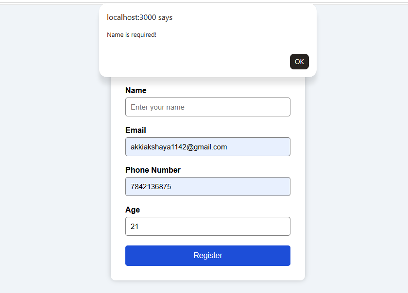
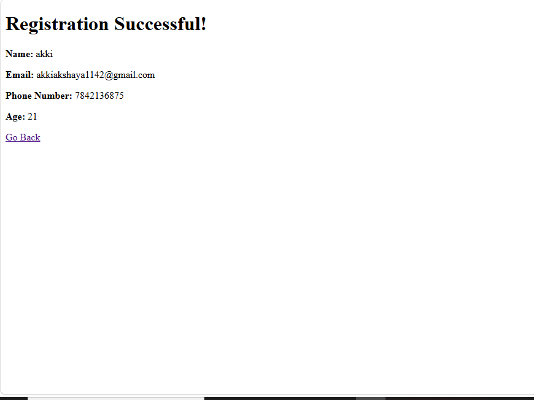
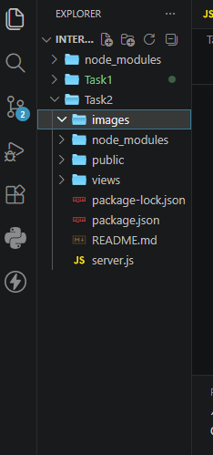

# User Registration Form

A simple user registration form built using **Node.js, Express.js, EJS, HTML, CSS, and JavaScript**.

## Features

- User Registration
- Form Validation
- Responsive UI
- Dynamic Result Page

## Technologies Used

- HTML
- CSS
- JavaScript
- Node.js
- Express.js
- EJS

## Screenshots

### Registration Form

### Validation

### Result Page

### Project Structure

## Author

**Akshaya**